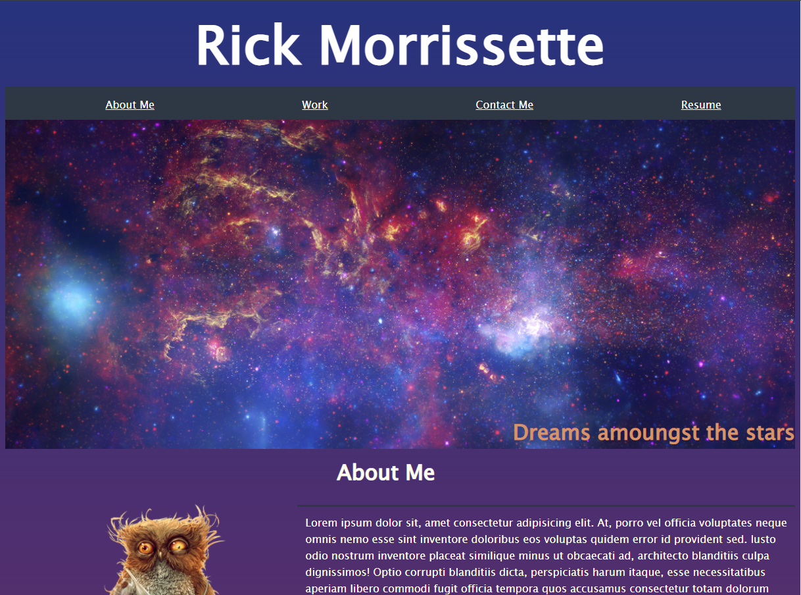

v1.0
Created a basic developer portfolio with styling featuring Captain Planets desire to get into the developer world. Used flexbox to organize elements as well as dynamic elements for anchors that link to future projects. Media queries are setup for different viewports as well as some subtle transitions.

v1.1
Updated images and made the project cards now linked to proper projects. Anchor tags for Linkedin, GitHub, and Resume are now functional. 

[Link to final project webpage](https://confusedicarus.github.io/07-professional-portfolio-update/)
